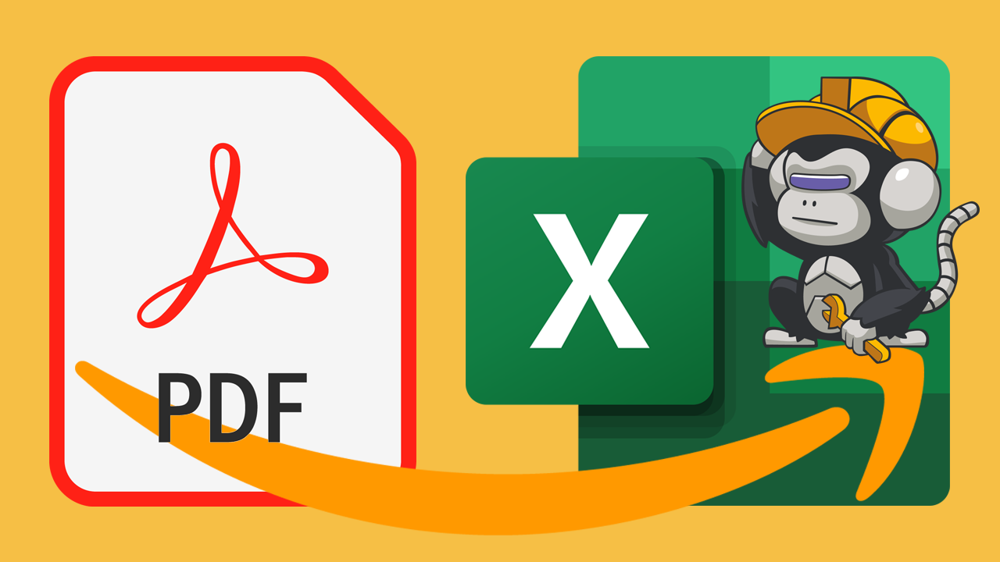
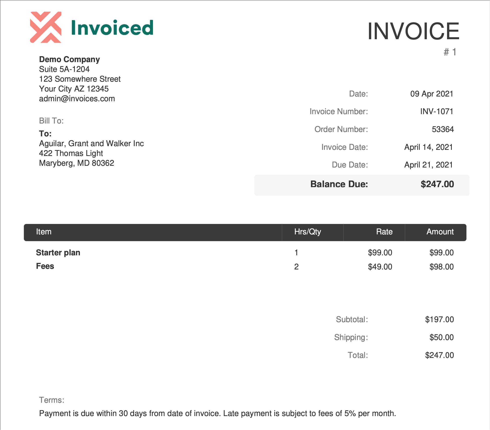
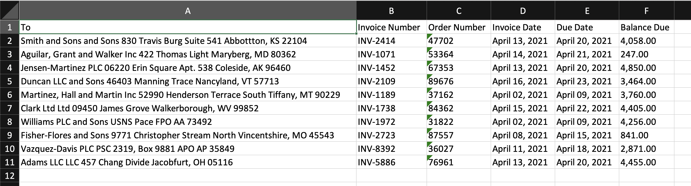
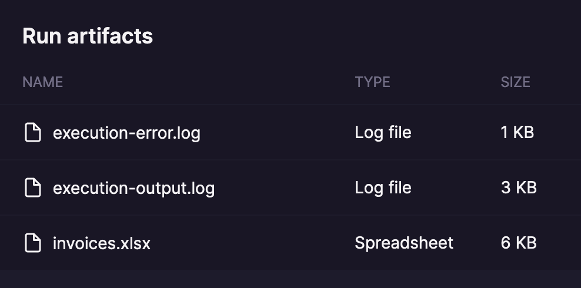
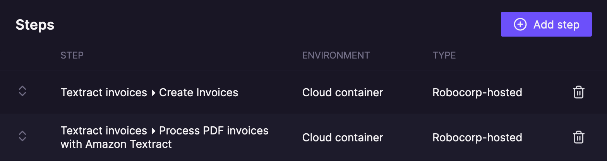

# Process PDF invoices with Amazon Textract



[PDF](https://en.wikipedia.org/wiki/PDF) - The most machine-readable document format ever! Right? 🙈

> Extracting text from PDF files is not a simple operation. PDF was never meant to be a format to _read data from_: its purpose is to provide an accurate way of reproducing documents and make them portable to any system. - [How to read PDF files with RPA Framework](https://robocorp.com/docs/development-guide/pdf/how-to-read-pdf-files)!

Still, it **is** possible to automatically read and extract invoice data from PDF documents and save the data to an [Excel](https://en.wikipedia.org/wiki/Microsoft_Excel) file. No more manual copy & pasting!

This robot processes randomly generated PDF invoices with [Amazon Textract](https://aws.amazon.com/textract/) and saves the extracted invoice data in an Excel file.

## Example PDF invoice



## Example Excel



## Tasks

The robot provides three tasks:

- `Create Invoices`
- `Process PDF invoices with Amazon Textract`
- `Delete Files From Amazon S3 Bucket`

### Create Invoices

- Generates random PDF invoices and uploads them to [Amazon S3](https://aws.amazon.com/s3/) bucket.
- Saves the generated PDF invoices to the output directory for debugging purposes.


### Process PDF invoices with Amazon Textract

- Reads the invoices from the Amazon S3 bucket.
- Processes the invoices with Amazon Textract.
- Saves the extracted invoice data in an Excel file in the output directory.
- Finally, deletes the PDF invoices from the Amazon S3 bucket.



### Delete Files From Amazon S3 Bucket

- A utility task for deleting the PDF invoices from the Amazon S3 bucket.
- Can be executed separately when you want to empty the Amazon S3 bucket.
- Called by the `Process PDF invoices with Amazon Textract` task in the teardown phase.

## Prerequisites

### Amazon API key and key ID with access to Amazon S3 and Amazon Textract

The robot requires access to Amazon S3 and Amazon Textract services. It needs an API key, key ID, and the AWS region. Check out [Amazon Textract Developer Guide](https://docs.aws.amazon.com/textract/latest/dg/what-is.html)!

### Store the API key, key ID, and the AWS region in Robocorp Vault

Set up [Robocorp Vault](https://robocorp.com/docs/development-guide/variables-and-secrets/vault) either locally or in [Control Room](https://robocorp.com/docs/robocorp-cloud/overview).

For a local run, use the following configuration:

`/Users/username/vault.json`:

```json
{
  "aws": {
    "AWS_KEY": "aws-key",
    "AWS_KEY_ID": "aws-key-id",
    "AWS_REGION": "us-east-1"
  }
}
```

`devdata/env.json`:

```json
{
  "RPA_SECRET_MANAGER": "RPA.Robocloud.Secrets.FileSecrets",
  "RPA_SECRET_FILE": "/Users/username/vault.json"
}
```

For Control Room run, create a new vault entry in Control Room.

- Enter `aws` as the name.
- Provide values for the `AWS_KEY`, `AWS_KEY_ID`, and `AWS_REGION` keys:


## Running

1. Run the `Create Invoices` task to create the PDF invoices.

2. Run the `Process PDF invoices with Amazon Textract` task to process the PDF invoices and to generate the Excel file with the data extracted from the invoices.

Optional: Run the `Delete Files From Amazon S3 Bucket` task if you want to delete the PDF invoices from the Amazon S3 bucket (the `Process PDF invoices with Amazon Textract` task does this automatically in the teardown phase).

When running in Control Room, add the `Create Invoices` and `Process PDF invoices with Amazon Textract` as process steps:



## Further reading

- [Handling PDF files](https://robocorp.com/docs/development-guide/pdf)
- [How to read PDF files with RPA Framework](https://robocorp.com/docs/development-guide/pdf/how-to-read-pdf-files)
- [What is Amazon Textract?](https://docs.aws.amazon.com/textract/latest/dg/what-is.html)
- [Cloud machine learning (ML) APIs example robot](https://robocorp.com/docs/development-guide/ai-machine-learning/cloud-machine-learning-apis)
- [RPA.Cloud.AWS library](https://robocorp.com/docs/libraries/rpa-framework/rpa-cloud-aws)
